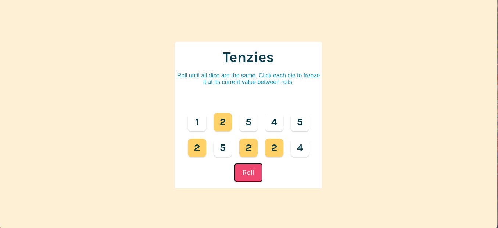

# 🎲 Tenzies Game

A fun and interactive Tenzies game built with React and Vite. The goal is to get all ten dice to show the same number.



## ✨ Features

- **Roll Dice**: Start the game or re-roll non-held dice with a single button click.
- **Hold Dice**: Click on any die to freeze it at its current value.
- **Win Condition**: The game is won when all dice have the same value.
- **Confetti Celebration**: A satisfying confetti explosion celebrates your victory!
- **New Game**: Easily start a new game after winning.

## 🚀 Technologies Used

- [React](https://reactjs.org/)
- [Vite](https://vitejs.dev/)
- [nanoid](https://github.com/ai/nanoid) for generating unique IDs.
- [react-confetti](https://github.com/alampros/react-confetti) for the winning animation.

## 🎮 How to Play

1.  Click the **"Roll"** button to roll the dice.
2.  Click on any die to "hold" it. Held dice will not change value on the next roll.
3.  Continue rolling until all dice show the same number.
4.  Once you've won, click **"New Game"** to play again.

## 🛠️ Getting Started

Follow these instructions to get a copy of the project up and running on your local machine.

### Prerequisites

You need to have [Node.js](https://nodejs.org/) and [npm](https://www.npmjs.com/) installed on your machine.

### Installation

1.  Clone the repository (you'll need to replace the URL with your own):
    ```sh
    git clone https://github.com/0xYurii/tenzies-game.git
    ```
2.  Navigate into the project directory:
    ```sh
    cd tenzies-game
    ```
3.  Install the dependencies:
    ```sh
    npm install
    ```
4.  Start the development server:
    ```sh
    npm run dev
    ```

Open your browser to the local server address provided by Vite to see the game in action!
